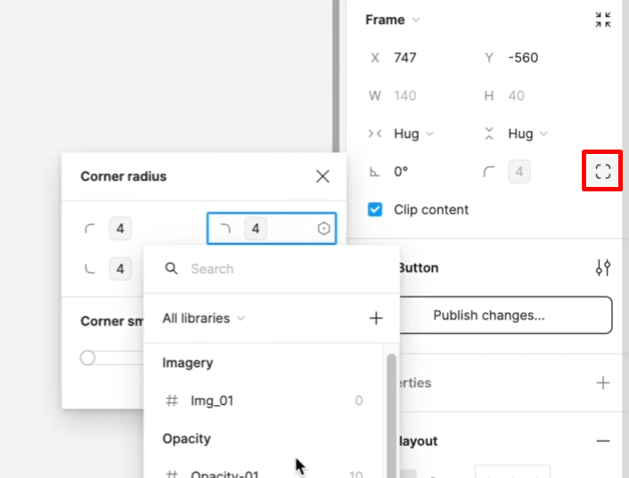

# Guide: Individual Corner Radius Tokens

This document details the complete workflow for managing independent corner radii using a token system, from creating variables in Figma to their final representation in a JSON file.

---

## Step 1: Creating the Variables in Figma

The first step is to define each corner radius as a primitive **`Number`** type variable. This is done in the "Local Variables" panel (`Shift + L`).

A variable is created for each corner, using a slash (`/`) naming convention to group them logically.

**Variables Created:**

- **Name:** `radius/top-left`, **Value:** `16`
- **Name:** `radius/top-right`, **Value:** `8`
- **Name:** `radius/bottom-right`, **Value:** `16`
- **Name:** `radius/bottom-left`, **Value:** `0`

**This is how it would look in the Figma panel:**

| Name             | Value | Type    |
| :--------------- | :---- | :------ |
| 🔽 radius        |       | (Group) |
| ├── top-left     | `16`  | Number  |
| ├── top-right    | `8`   | Number  |
| ├── bottom-right | `16`  | Number  |
| └── bottom-left  | `0`   | Number  |

---

## Step 2: Assigning the Variables in Figma

Once the variables are created, they are assigned to an object (like a rectangle or a frame).

1. **Select the Object:** Choose the layer you want to apply the radii to.
2. **Enable Independent Corners:** In the design panel, under the "Corner Radius" section, click the **"Independent corners"** icon to display the four input fields.
3. **Assign each Variable:** Click the "variables" icon for each field and select the corresponding variable from the list (`radius/top-left` for the top-left corner, etc.).

**The result in the Figma design panel:**

{width="500"}
_(Visual representation of the design panel)_

---

## Step 3: Translating to Token Files

This setup in Figma translates directly into a `tokens.json` file. A plugin like "Tokens Studio" or a custom tool would export the variables into the following structure, adding the token type (`dimension`) and units (`px`).

```json
{
  "radius": {
    "top-left": {
      "$value": "16px",
      "$type": "dimension",
      "$description": "Radius for the top-left corner."
    },
    "top-right": {
      "$value": "8px",
      "$type": "dimension",
      "$description": "Radius for the top-right corner."
    },
    "bottom-right": {
      "$value": "16px",
      "$type": "dimension",
      "$description": "Radius for the bottom-right corner."
    },
    "bottom-left": {
      "$value": "0px",
      "$type": "dimension",
      "$description": "Radius for the bottom-left corner (a straight corner)."
    }
  }
}
```
